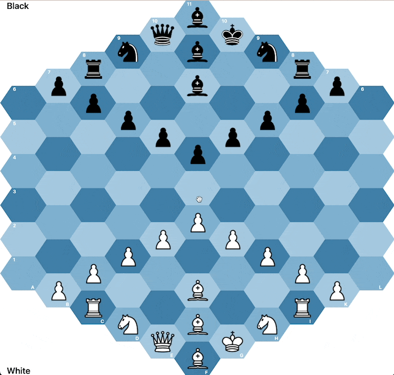
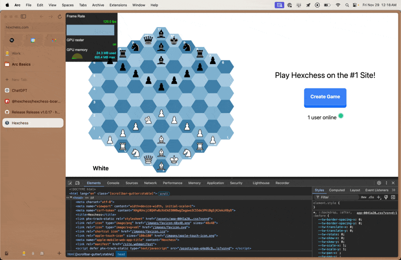

# [hexchess-board](https://hexagonchess.github.io/hexchess-board/)

`hexchess-board` is a performant, dependency-free web component implementation of Glinsky's [Hexagonal Chess](https://en.wikipedia.org/wiki/Hexagonal_chess).



## Features:

1. Performant - The component has been extensively benchmarked against Chess.com's own board, and clocks in at 120 FPS when dragging pieces around the board (based on Chrome's developer tools) and ~115 FPS when resizing the window (the most expensive operation).

|Move Piece|Resize|
|:--------:|:----:|
|||

2. Completely customizable - every single color you see can be changed to whatever fits your style and liking! Soon, we will support [slots](https://developer.mozilla.org/en-US/docs/Web/HTML/Element/slot), which will also allow you to customize the pieces on the board.

3. Can be standalone without a server! `hexchess-board` ships with a complete game engine that can detect illegal moves, checkmate, stalemate, and more! You can play with two players on the same laptop without any other dependencies, should you choose.

4. Zero dependencies - built entirely using web standards, this board requires absolutely no external dependencies, so the footprint stays extremely small.

Read the full documentation on [the website](https://mganjoo.github.io/gchessboard/).

## Dark mode

`hexchess-board` follows the surrounding page's preferred color scheme automatically (via `prefers-color-scheme`). You can override this behavior at any time with the `color-scheme` attribute or the `colorScheme` property (`'light'`, `'dark'`, or `'auto'`, which is the default).

```html
<hexchess-board color-scheme="dark"></hexchess-board>
```

Light mode keeps the existing pastel palette (`#a5c8df`, `#80b1d0`, `#4180a9`, `#e4c7b7`, etc.). Dark mode switches to deeper blues and warm highlights:

- Board background `#050b16`
- Tiles `#2f6b8f`, `#1f4767`, `#0f2b40`
- Move highlights / capture rings `#f3c989`
- Labels/player text `#f6f7fb`

All of these values still come from the same CSS custom properties (`--hexchess-*`), so you can override individual colors per theme if you'd like.

For per-theme customization without duplicating selectors, you can scope variables with `-light` or `-dark` suffixes (`--hexchess-board-bg-dark`, `--hexchess-board-bg-light`, etc.). When a themed value isn't provided, the component falls back to the base `--hexchess-*` value and then to the built-in palette.

## Sound effects

`<hexchess-board>` now ships with pointers to Lichess's [standard sound pack](https://github.com/lichess-org/lila/tree/master/public/sound/standard) (`move`, `capture`, `check`, `checkmate`, `victory`, `defeat`, `draw`). The default cue URLs stream directly from that repository (keeping the npm tarball tiny), and sounds are preloaded as soon as the element is connected so they fire instantly when moves resolve, check is declared, or the game finishes. Browsers still require a user gesture before audio playback, so either let players click/tap the board once or call `board.prepareAudio()` inside your own button handler.

- Toggle audio entirely via the boolean `muted` attribute/property or the declarative `audio="off"` attribute (`audio="on"` or the absence of the attribute re-enables sounds).
- Override specific cues by assigning a `soundPack` object. Each entry accepts a string URL, `null` (disable), or `{src, volume, playbackRate}`.
- Default cue URLs point at `https://raw.githubusercontent.com/lichess-org/lila/master/public/sound/standard/*.mp3`. If you need to run offline or use your own branding, copy those files to your infra/CDN and point `soundPack` to the new URLs (respecting their AGPL-3.0 license).

```js
const board = document.querySelector('hexchess-board');
board.soundPack = {
  move: '/my-sounds/move.mp3',
  capture: { src: '/my-sounds/capture.mp3', volume: 0.75 },
  victory: null, // turn off the victory cue
};

startButton.addEventListener('click', () => {
  board.prepareAudio(); // unlocks + preloads audio inside a user gesture
});
```

If you want to reuse the shipped cues from JS you can import `DEFAULT_SOUND_PACK` from the package and merge it with your overrides.

## Installing

`hexchess-board` is packaged as a [Web Component](https://developer.mozilla.org/en-US/docs/Web/Web_Components) and should be usable directly in most modern browsers. It bundles its own (configurable) styles, inline assets (for chess pieces), and code.

#### In HTML (using unpkg)

```html
<!-- Polyfills only needed for Firefox and Edge. -->
<script src="https://unpkg.com/@webcomponents/webcomponentsjs@latest/webcomponents-loader.js"></script>
<!-- Do NOT use unpkg due to https://github.com/mjackson/unpkg/issues/351 -->
<script type="module" src="https://esm.sh/@hexchess/hexchess-board@latest/hexchess-board.js?module"></script>
```

#### As a module import

First, install from NPM:

```sh
npm install '@hexchess/hexchess-board'
```

#### JS

```js
import { HexchessBoard } from 'https://esm.sh/@hexchess/hexchess-board@latest/hexchess-board.js?module';
```

## Developing

Run `npm run docs` after making any changes to documentation, and `npm run docs:serve` in the background to consistently have the local changes reflected.

When developing on the actual web component, keep `npm run serve` running in the background. After making changes, run `npm run build` and you'll see them show up.

Remember to format all code after modifications with `npm run format`!

Both `npm run serve` and `npm run docs:serve` will *try* to use http://localhost:8000, but if that port is taken they will keep incrementing until they find an available port.

## Attribution

Chess piece SVG images included in this library were adapted from
[Category:SVG chess pieces](https://commons.wikimedia.org/wiki/Category:SVG_chess_pieces)
on Wikmedia.

## Acknowledgements

This could not be possible without the sage advice of [Milind Ganjoo](https://github.com/mganjoo), who has built an extremely impressive [`gchessboard` web component](https://github.com/mganjoo/gchessboard)! A lot of the inspiration for this project came from him, and many of the early bugs were squashed with his help.
