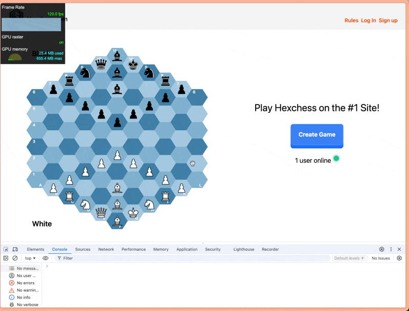

# [hexchess-board](https://hexagonchess.github.io/hexchess-board/)

`hexchess-board` is a performant, dependency-free web component implementation of Glinsky's [Hexagonal Chess](https://en.wikipedia.org/wiki/Hexagonal_chess).


## Features:

1. Performant - The component has been extensively benchmarked against Chess.com's own board, and clocks in at 120 FPS when dragging pieces around the board (based on Chrome's developer tools) and ~115 FPS when resizing the window (the most expensive operation).

|Move Piece|Resize|
|:--------:|:----:|
|||

2. Completely customizable - every single color you see can be changed to whatever fits your style and liking! Soon, we will support [slots](https://developer.mozilla.org/en-US/docs/Web/HTML/Element/slot), which will also allow you to customize the pieces on the board.

3. Can be standalone without a server! `hexchess-board` ships with a complete game engine that can detect illegal moves, checkmate, stalemate, and more! You can play with two players on the same laptop without any other dependencies, should you choose.

4. Minimal dependencies - the web component has a single dependency that, when shipped in production mode, can mostly be tree shaken away. We use [Lit](https://lit.dev) for developer convenience when creating the web component, but the footprint is extremely small.

Read the full documentation on [the website](https://mganjoo.github.io/gchessboard/).

## Installing

`hexchess-board` is packaged as a [Web Component](https://developer.mozilla.org/en-US/docs/Web/Web_Components) and should be usable directly in most modern browsers. It bundles its own (configurable) styles, inline assets (for chess pieces), and code.

#### In HTML (using unpkg)

```html
<!-- Polyfills only needed for Firefox and Edge. -->
<script src="https://unpkg.com/@webcomponents/webcomponentsjs@latest/webcomponents-loader.js"></script>
<!-- Do NOT use unpkg due to https://github.com/mjackson/unpkg/issues/351 -->
<script type="module" src="https://esm.sh/@hexchess/hexchess-board@latest/hexchess-board.js?module"></script>
```

#### As a module import

First, install from NPM:

```sh
npm install '@hexchess/hexchess-board'
```

#### JS

```js
import { HexchessBoard } from 'https://esm.sh/@hexchess/hexchess-board@latest/hexchess-board.js?module';
```

## Developing

Run `npm run docs` after making any changes to documentation, and `npm run docs:serve` in the background to consistently have the local changes reflected.

When developing on the actual web component, keep `npm run serve` running in the background. After making changes, run `npm run build` and you'll see them show up.

Remember to format all code after modifications with `npm run format`!

Both `npm run serve` and `npm run docs:serve` will *try* to use http://localhost:8000, but if that port is taken they will keep incrementing until they find an available port.

## Attribution

Chess piece SVG images included in this library were adapted from
[Category:SVG chess pieces](https://commons.wikimedia.org/wiki/Category:SVG_chess_pieces)
on Wikmedia.

## Acknowledgements

This could not be possible without the sage advice of [Milind Ganjoo](https://github.com/mganjoo), who has built an extremely impressive [`gchessboard` web component](https://github.com/mganjoo/gchessboard)! A lot of the inspiration for this project came from him, and many of the early bugs were squashed with his help.
